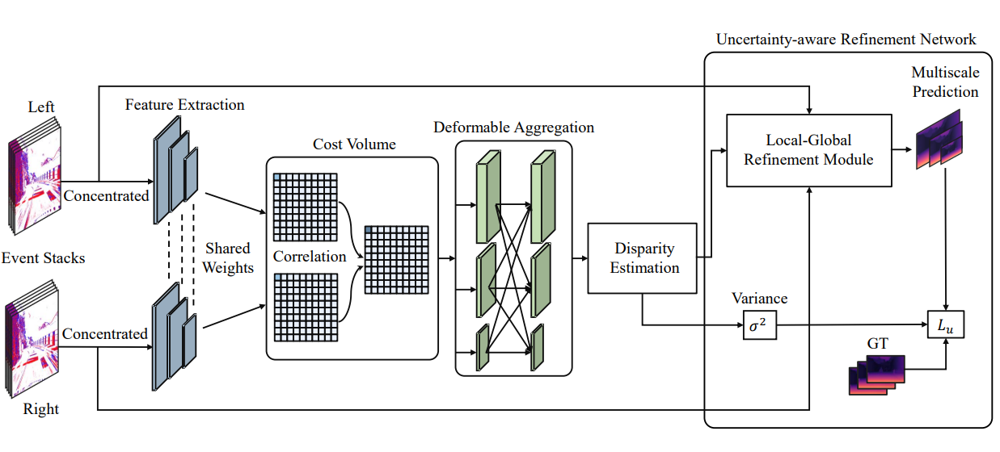

# URNet
This is an official code repo for "**URNet: Uncertainty-aware Refinement Network for Event-based Stereo Depth Estimation**"



### Dataset
Download [DSEC](https://dsec.ifi.uzh.ch/) datasets.

#### Data structure
Our folder structure is as follows:
```
DSEC
├── train
│   ├── interlaken_00_c
│   │   ├── calibration
│   │   │   ├── cam_to_cam.yaml
│   │   │   └── cam_to_lidar.yaml
│   │   ├── disparity
│   │   │   ├── event
│   │   │   │   ├── 000000.png
│   │   │   │   ├── ...
│   │   │   │   └── 000536.png
│   │   │   └── timestamps.txt
│   │   └── events
│   │       ├── left
│   │       │   ├── events.h5
│   │       │   └── rectify_map.h5
│   │       └── right
│   │           ├── events.h5
│   │           └── rectify_map.h5
│   ├── ...
│   └── zurich_city_11_c                
└── test
    ├── interlaken_00_a
    │   ├── calibration
    │   │   ├── cam_to_cam.yaml
    │   │   └── cam_to_lidar.yaml
    │   ├── events
    │   │   ├── left
    │   │   │   ├── events.h5
    │   │   │   └── rectify_map.h5
    │   │   └── right
    │   │       ├── events.h5
    │   │       └── rectify_map.h5
    │   └── interlaken_00_a.csv
    ├── ...
    └── zurich_city_15_a                
```


## Getting started

### Build deformable convolution
```bash
cd /root/code/src/components/models/deform_conv && bash build.sh
```

## Training
```bash
cd /root/code/scripts
bash distributed_main.sh
```

## Inference
```bash
cd /root/code
python3 inference.py \
    --data_root /root/data \
    --checkpoint_path <PATH/TO/CHECKPOINT.PTH> \
    --save_root <PATH/TO/SAVE/RESULTS>
```

## Literatures
- [Stereo Depth from Events Cameras: Concentrate and Focus on the Future](https://openaccess.thecvf.com/content/CVPR2022/papers/Nam_Stereo_Depth_From_Events_Cameras_Concentrate_and_Focus_on_the_CVPR_2022_paper.pdf)

## License

MIT license.
